# OnyxCore — Project Features Documentation

> **Version:** 1.0.0 | **Platform:** Linux | **Framework:** Flutter 3.x + Dart SDK ^3.10.4

---

## Summary

OnyxCore is a Linux-native multimedia file manager built with Flutter. It combines a full-featured directory browser with integrated media viewers (image, video, audio, markdown) in a single application. The app uses a custom "Onyx Monolith" dark design system, Riverpod state management, isolate-based file I/O, and a persistent multi-window viewer architecture powered by `desktop_multi_window`.

---

## Tools & Packages

| Category | Package | Version | Purpose |
|---|---|---|---|
| **State** | `flutter_riverpod` | ^3.3.1 | Global reactive state management |
| **Media** | `media_kit` | ^1.2.6 | Video/audio playback engine |
| | `media_kit_video` | ^2.0.1 | Video rendering widget |
| | `media_kit_libs_video` | ^1.0.7 | Native codec libraries |
| **Window** | `desktop_multi_window` | ^0.3.0 | Multi-window IPC |
| | `window_manager` | ^0.5.1 | Window lifecycle control |
| **Storage** | `hive` / `hive_flutter` | ^1.1.0 | Local key-value persistence |
| | `shared_preferences` | ^2.2.3 | Settings persistence |
| **UI** | `google_fonts` | ^6.2.1 | Typography (Manrope, Outfit, JetBrains Mono) |
| | `flutter_svg` | ^2.2.4 | SVG icon rendering |
| | `flutter_markdown` | ^0.7.1 | Markdown rendering |
| **Utility** | `path` | ^1.9.0 | Path manipulation |
| | `intl` | ^0.19.0 | Number formatting |
| | `equatable` | ^2.0.7 | Value equality |
| | `uuid` | ^4.5.3 | Unique ID generation |
| | `file` | ^7.0.0 | Filesystem abstraction (DI for tests) |
| | `image` | ^4.8.0 | Image processing |
| | `path_provider` | ^2.1.5 | Platform directories |
| | `watcher` | ^1.2.1 | File system watching |
| **Lint** | `very_good_analysis` | ^10.1.0 | Static analysis rules |
| **Test** | `flutter_test` | SDK | Widget testing framework |
| | `mocktail` | ^1.0.4 | Mock object generation for tests |
| **External** | `ffmpeg` (CLI) | system | Image editing (rotate, crop, brightness); hover thumbnail extraction (video preview) |
| | `lsblk` / `udisksctl` (CLI) | system | Device detection & mounting |
| | `gio` (CLI) | system | Trash operations |

---

## Architecture Diagram

```mermaid
graph TB
    subgraph Entry["Application Entry"]
        Main["main.dart"] --> |"Primary Engine"| App["OnyxCoreApp"]
        Main --> |"Secondary Engine + IPC Args"| SecWin["SecondaryWindowApp"]
    end

    subgraph Core["core/"]
        Theme["AppTheme / AppColors"]
        Cache["DirectoryCache (30s TTL)"]
        MetaCache["MetadataCache (aspect ratios)"]
        DirWatcher["DirectoryWatcher (inotify)"]
        WinMgmt["PersistentViewerManager"]
        Widgets["ViewerTopBar / BubbleLoader"]
        Utils["StringUtils / FileTypeClassifier / FileTypeUtils"]
    end

    subgraph Features["features/"]
        subgraph DirBrowser["directory_browser"]
            Data["LocalFileDatasource (Isolate I/O)"]
            Domain["FileItem / SortSettings / FilterSettings / Device"]
            Providers["DirectoryProviders / TabManager / TaskNotifier / SelectionNotifier"]
            Pages["GalleryPage (Main Orchestrator)"]
            BrowserWidgets["TopBar / Sidebar / FileGrid / ItemCard / ContextMenu / OpenWithDialog / FilterOverlay / SortOverlay / BackgroundPanel / TaskHistory"]
            Utils["AppLauncherUtils / DirectorySizeUtils / FileTypeUtils / StringUtils"]
        end

        subgraph ImageViewer["image_viewer"]
            ImgPreview["ImagePreviewWidget"]
            ImgEditor["ImageEditorOverlay (ffmpeg)"]
        end

        subgraph VideoPlayer["video_player"]
            VidPreview["VideoPreviewWidget"]
            HoverPrev["HoverPreview (ffmpeg subprocess)"]
            VidWidgets["VideoPreviewWidget / MarkerEditor / HoverPreview / PlaylistOverlay / TrackSelector / VolumeOverlay / SpeedOverlay / TimelineMarker"]
            PlaybackMem["PlaybackMemoryRepository (Hive)"]
        end

        subgraph AudioPlayer["audio_player"]
            AudioView["AudioPlayerView"]
            AudioWidgets["HeroAudioPlayer / WaveformScrubber / AudioControlsBar / PlaylistSidebar"]
        end

        subgraph DocViewer["document_viewer"]
            MdPreview["MarkdownPreviewWidget"]
        end

        subgraph Settings["settings"]
            SettingsEntity["AppSettings"]
            SettingsRepo["SettingsRepository (SharedPreferences)"]
            SettingsUI["SettingsDialog"]
        end
    end

    App --> Pages
    Pages --> BrowserWidgets
    Pages --> ImgPreview
    Pages --> VidPreview
    Pages --> AudioView
    Pages --> MdPreview
    WinMgmt --> SecWin
    SecWin --> ImgPreview
    SecWin --> VidPreview
    SecWin --> AudioView
    SecWin --> MdPreview
```



---

## Project Structure

```
onyxcore/
├── lib/
│   ├── main.dart                          # Entry point, engine routing
│   ├── app.dart                           # OnyxCoreApp MaterialApp wrapper
│   ├── services/
│   │   └── file_system_service.dart       # Abstracted FS via `file` package (DI-ready)
│   ├── core/
│   │   ├── cache/
│   │   │   ├── directory_cache.dart       # In-memory dir cache (30s TTL)
│   │   │   └── metadata_cache.dart        # Image aspect ratio cache
│   │   ├── errors/
│   │   │   ├── exceptions.dart            # Custom exception types
│   │   │   └── failures.dart              # Failure models
│   │   ├── platform/
│   │   │   ├── directory_watcher.dart     # inotify-based FS watcher
│   │   │   └── disk_usage.dart            # Disk usage utilities
│   │   ├── theme/
│   │   │   ├── app_colors.dart            # Onyx Monolith color palette
│   │   │   └── app_theme.dart             # Gradients, ThemeData
│   │   ├── utils/
│   │   │   ├── string_utils.dart          # formatBytes, truncateMiddle
│   │   │   ├── file_type_classifier.dart  # Extension → FileItemType map
│   │   │   ├── file_type_utils.dart       # Folder/file icon configs
│   │   │   ├── directory_size_utils.dart  # Recursive size calc (isolate)
│   │   │   ├── extensions.dart            # Dart extension methods
│   │   │   ├── formatters.dart            # Date/number formatters
│   │   │   └── logger.dart                # Logging utility
│   │   ├── widgets/
│   │   │   ├── bubble_loader.dart         # Animated bubble loading indicator
│   │   │   ├── onyx_switch.dart           # Gradient toggle switch widget
│   │   │   ├── task_progress_overlay.dart # Task progress overlay widget
│   │   │   └── viewer_top_bar.dart        # Shared glassmorphism top bar
│   │   └── window_management/
│   │       ├── persistent_viewer_manager.dart  # Window reuse manager
│   │       ├── secondary_window_app.dart       # Secondary engine bootstrap
│   │       ├── window_controller_extension.dart# Engine-aware controller
│   │       └── window_params.dart              # IPC payload model
│   └── features/
│       ├── directory_browser/
│       │   ├── data/
│       │   │   ├── datasources/
│       │   │   │   ├── local_file_datasource.dart     # Isolate file ops
│       │   │   │   └── media_metadata_datasource.dart # Image metadata extraction
│       │   │   └── repositories/
│       │   │       └── directory_repository_impl.dart  # Repository implementation
│       │   ├── domain/
│       │   │   ├── entities/
│       │   │   │   ├── file_item.dart          # Core file entity
│       │   │   │   ├── sort_settings.dart       # Sort options enum
│       │   │   │   ├── filter_settings.dart      # Filter criteria model
│       │   │   │   ├── device.dart              # Block device model
│       │   │   │   ├── directory_state.dart      # Directory state model
│       │   │   │   ├── navigation_state.dart     # Navigation history state
│       │   │   │   ├── selection_state.dart       # Selection state model
│       │   │   │   └── tab_state.dart            # Tab state model
│       │   │   └── repositories/
│       │   │       └── directory_repository.dart # Repository interface
│       │   └── presentation/
│       │       ├── pages/
│       │       │   └── gallery_page.dart         # Main UI orchestrator
│       │       ├── providers/
│       │       │   ├── background_panel_provider.dart  # Background panel state
│       │       │   ├── clipboard_provider.dart         # Copy/Cut clipboard state
│       │       │   ├── conflict_provider.dart          # File conflict resolution
│       │       │   ├── device_provider.dart            # Block device detection
│       │       │   ├── directory_providers.dart        # Core directory state providers
│       │       │   ├── navigation_notifier.dart        # Back/forward navigation
│       │       │   ├── selection_notifier.dart         # Multi-select state
│       │       │   ├── tab_manager.dart                # Tabbed interface state
│       │       │   ├── task_history_provider.dart      # Persistent task history
│       │       │   └── task_provider.dart              # Background task queue
│       │       └── widgets/
│       │           ├── action_bar.dart              # File operation action bar
│       │           ├── background_panel.dart        # Slide-out tasks panel
│       │           ├── background_processes_button.dart # Tasks panel toggle
│       │           ├── conflict_dialog.dart          # Skip/Overwrite/Rename dialog
│       │           ├── context_menu.dart             # Glassmorphism right-click menu
│       │           ├── dialogs.dart                  # Common dialog utilities
│       │           ├── empty_state_view.dart         # Empty folder/search/filter views
│       │           ├── error_dialog.dart             # Error display dialog
│       │           ├── file_grid.dart                # Responsive file grid layout
│       │           ├── filter_overlay.dart           # Advanced file type filter
│       │           ├── gnome_tab_bar.dart            # GNOME-style tab bar
│       │           ├── item_card.dart                # File/folder card widget
│       │           ├── item_preview.dart             # Inline file preview
│       │           ├── preview_container.dart        # Preview type router
│       │           ├── properties_dialog.dart        # File properties dialog
│       │           ├── rename_dialog.dart            # Bulk rename modal
│       │           ├── rename_popover.dart           # Inline rename popover
│       │           ├── rubber_band_overlay.dart      # Lasso selection overlay
│       │           ├── sort_overlay.dart             # Sort options overlay
│       │           ├── task_history_detail_view.dart # Task history detail
│       │           ├── task_history_view.dart        # Task history list
│       │           ├── task_tile.dart                # Active task tile
│       │           ├── top_bar.dart                  # Main window top bar
│       │           └── sidebar/
│       │               ├── sidebar.dart              # Main sidebar widget
│       │               ├── sidebar_item.dart         # Sidebar navigation item
│       │               ├── cloud_item.dart           # Cloud storage placeholder
│       │               ├── devices_section.dart      # Block device list
│       │               ├── overview_button.dart      # Sidebar overview button
│       │               └── storage_indicator.dart    # Disk usage indicator
│       ├── image_viewer/
│       │   └── presentation/widgets/
│       │       ├── image_preview_widget.dart    # Zoomable image viewer
│       │       └── image_editor_overlay.dart    # ffmpeg-based editor
│       ├── video_player/
│       │   ├── data/repositories/
│       │   │   ├── playback_memory_repository.dart  # Resume position (Hive)
│       │   │   └── marker_repository.dart           # Marker sidecar persistence
│       │   ├── domain/entities/
│       │   │   └── video_marker.dart                # Marker entity model
│       │   └── presentation/
│       │       ├── providers/
│       │       │   └── video_markers_provider.dart  # Marker state management
│       │       └── widgets/
│       │           ├── video_preview_widget.dart     # Main video player widget
│       │           ├── hover_preview.dart            # ffmpeg hover thumbnail
│       │           ├── playlist_overlay.dart         # Video playlist panel
│       │           ├── track_selector_menu.dart      # Audio/subtitle track picker
│       │           ├── playback_speed_control.dart   # Speed preset selector
│       │           ├── video_speed_overlay.dart      # Left-side speed slider
│       │           ├── video_volume_overlay.dart     # Right-side volume slider
│       │           ├── gradient_slider_track.dart    # Custom gradient slider shape
│       │           ├── marker_editor_overlay.dart    # Marker tag editor
│       │           ├── timeline_marker.dart          # Timeline marker icons
│       │           ├── emoji_data.dart               # Emoji category data
│       │           └── menu_tooltip.dart             # OverlayPortal tooltip
│       ├── audio_player/
│       │   ├── domain/entities/
│       │   │   └── audio_track.dart                 # Audio track entity
│       │   └── presentation/
│       │       ├── pages/
│       │       │   └── audio_player_view.dart       # Main audio player layout
│       │       ├── providers/
│       │       │   └── audio_player_providers.dart  # Audio state providers
│       │       └── widgets/
│       │           ├── hero_audio_player.dart        # Large album art player
│       │           ├── waveform_scrubber.dart        # Procedural waveform widget
│       │           ├── audio_controls_bar.dart       # Playback controls
│       │           └── playlist_sidebar.dart         # Audio playlist panel
│       ├── document_viewer/
│       │   └── presentation/widgets/
│       │       └── markdown_preview_widget.dart     # MD viewer + editor
│       ├── settings/
│       │   ├── data/repositories/
│       │   │   └── settings_repository_impl.dart    # SharedPreferences impl
│       │   ├── domain/
│       │   │   ├── entities/app_settings.dart        # Settings entity
│       │   │   └── repositories/settings_repository.dart # Repository interface
│       │   └── presentation/
│       │       ├── providers/settings_providers.dart  # Settings state
│       │       └── widgets/settings_dialog.dart       # Settings dialog UI
│       └── file_picker/
│           └── presentation/
│               ├── providers/
│               │   └── file_picker_notifier.dart     # Picker state + FS provider
│               └── widgets/
│                   ├── custom_file_picker_dialog.dart # Picker dialog UI
│                   ├── file_entity_tile.dart          # File list tile
│                   └── file_picker_preview_pane.dart  # Selection preview pane
├── services/
│   └── file_system_service.dart           # (mirrored above under lib/)
├── test/
│   ├── helpers/
│   │   └── file_system_helper.dart        # MemoryFileSystem factory + dummy tree
│   ├── mocks/
│   │   └── mocks.dart                     # Central Mocktail mock registry
│   ├── unit/
│   │   └── file_system_service_test.dart  # FileSystemService DI skeleton
│   ├── widgets/
│   │   └── file_grid_test.dart            # FileGrid widget DI skeleton
│   └── widget_test.dart                   # Legacy placeholder
├── assets/icons/                          # SVG file-type icons
└── pubspec.yaml
```

**Total: 113 Dart source files across 8 feature modules, core infrastructure, and services layer + 5 test files.**

---

## Detailed Feature Listing

### 1. Directory Browser

#### 1.1 Navigation
- **Breadcrumb bar** with clickable path segments and gradient separators
- Breadcrumb auto-scrolls to end on directory change (300ms `easeOut` animation)
- **Click-to-edit location bar** — tap breadcrumb to type a raw path, with validation & error toast (auto-dismisses after 2s)
- **Location bar full-text selection** — on activation, the entire path text is pre-selected for quick overwrite
- Context-aware root icon (Home, Storage, Trash, Recent, Starred)
- **Back/Forward history** via `NavigationNotifier` per-tab
- Keyboard: `Backspace` / `Alt+←` to go back
- **Shortcut Isolation**: Global file operation shortcuts (Copy, Cut, Paste) are automatically disabled when the breadcrumb location bar is in edit mode to prevent conflicts with standard text input.
- **Breadcrumb DragTarget**: Each breadcrumb segment is a `DragTarget<List<String>>` — files dragged onto a breadcrumb segment move to that directory. Hovering for 1s auto-navigates to the target path.
- **Breadcrumb device-aware rendering**: Breadcrumbs dynamically resolve external device mount paths, matching the longest device path first, and display the device name as the root segment.
- **Breadcrumb preview file segment**: When a file is previewed inline, the filename is appended as a non-clickable gradient breadcrumb segment (max 32 chars, middle-truncated).
- **Sidebar** with quick-access: Home, Desktop, Documents, Music, Pictures, Videos, Downloads, Recent, Trash
- Sidebar **Devices section**: auto-detects block devices via `lsblk --json`, auto-mount via `udisksctl`
- Sidebar **Cloud Storage** placeholder section
- Sidebar **Storage indicator** showing disk usage
- Sidebar **Overview button**
- **Sidebar navigation pattern**: All sidebar items clear preview state, deselect all items, update navigation history, and set current path atomically.

#### 1.2 Tabbed Interface
- **GNOME-inspired tab bar** with dynamic non-stretched tab widths (minimum 140px, auto-calculated to fill available width)
- 3px gradient bottom indicator on active tab (`AppTheme.primaryGradient`)
- Vertical 1px border separators between tabs
- Close button per tab (visible only on hover or active tab)
- Active tab: `ShaderMask` gradient text + gradient icon; inactive tab: white54/white70 text
- **Context-aware tab icon** — dynamically selects icon based on folder name (Downloads → download icon, Pictures → image icon, Music → music note, etc.)
- **Tab DragTarget**: Each tab is a `DragTarget<List<String>>` — files dragged onto a tab move to that tab's directory. Hovering 1s auto-switches to that tab.
- **Tab bar auto-hide**: Bar is hidden (`SizedBox.shrink()`) when only a single tab is open
- **Tab bar auto-scroll**: Scrolls to reveal newly created tabs (300ms `easeOut` animation)
- New tab button
- Each tab has independent: path, history, selection, sort settings, filter settings, search state, location editing state, refresh count
- **Per-folder sort persistence**: When navigating to a folder, its previously-saved sort preference is loaded from `SharedPreferences` via `SettingsRepository.getFolderSort()`. Falls back to the global default.
- **Filter reset on navigate**: Filters are automatically cleared when navigating to a new folder.
- **Last tab protection**: The last remaining tab cannot be closed — prevents accidental application exit.

#### 1.3 File Grid
- **Responsive grid** layout with zoom-dependent column count (`SliverGridDelegateWithMaxCrossAxisExtent`, `maxCrossAxisExtent: 180 * zoom`, `mainAxisExtent: 215 * zoom`)
- **Zoom slider** (Ctrl+Scroll) per-folder zoom levels stored in a `Map<String, double>` (default 0.8x)
- Thumbnail previews for images (with `cacheWidth: 300` optimization)
- SVG file rendering via `flutter_svg` (`SvgPicture.file`)
- Custom gradient folder icons with colored tabs (context-aware per folder name via `getFolderIconConfig`)
- Custom SVG icons for video, audio, archive, executable, readme files (via `getFileIconConfig`)
- **Archival icon builder**: Folders use a stacked `Container` approach with a small colored "tab" on top-left and a gradient body underneath, mimicking physical folder tabs
- **Lock icon badge** on read-only items (positioned top-right with semi-transparent black background)
- **Middle-truncated filenames** for long names (60% start + 30% end, max 35 chars)
- File name rendered in Manrope font, 2-line max with ellipsis; font size scales with zoom (clamped at 0.8–1.1x)
- **Non-Destructive Refresh**: Implements a persistent state mechanism in the grid. During directory updates, the current grid items remain visible instead of resetting to a loading state, completely eliminating UI flickering.
- **Background Stability (Granular Reactivity)**: Optimized directory providers using `ref.watch(settingsProvider.select((s) => s.showHiddenFiles))` to exclusively monitor the hidden-files setting. This strictly prevents unwanted background file refreshes and UI stutters when opening, resizing, or interacting with overlays (Settings, Open With, etc.) that modify other application state.
- **Isolate-Optimized Metadata**: Thumbnail aspect ratio extraction is deferred to background isolates and cached, ensuring the UI thread remains responsive even in folders with thousands of images.
- **Seamless State Transitions**: Uses implicit type-based keys in `AnimatedSwitcher` to prevent duplicate-key crashes during rapid async directory refreshes
- **Grid-level DragTarget**: The entire file grid background is a `DragTarget<List<String>>` — files dropped on empty grid space move to the current directory, with full conflict resolution (skip/overwrite/rename) and per-item progress tracking
- **Refresh opacity dimming**: Grid content dims to 20% opacity (`AnimatedOpacity`) during active directory refresh
- **App lifecycle observer**: Implements `WidgetsBindingObserver` to cancel all active tasks when the app is detached or hidden
- **Cut item dimming**: Items on the clipboard in "cut" mode render at 40% opacity

#### 1.4 Selection System
- **Click to select** (single)
- **Ctrl+Click** for additive multi-select
- **Shift+Click** for range selection with transient anchor index
- **Ctrl+A** to select all
- **Rubber-band (lasso) selection** overlay via `RubberBandOverlay`
- Selection count shown in status indicators

#### 1.5 File Operations
- **Copy** (Ctrl+C) / **Cut** (Ctrl+X) / **Paste** (Ctrl+V) via clipboard provider
- **Move** via drag-and-drop onto folders, breadcrumb segments, or tab headers
- **Delete to Trash** via `gio trash` (Delete key) — progress tracked per-item with `onProgress` callback
- **Permanent Delete Confirmation**: 
  - **Dashboard-Style Stats**: Features a dedicated statistics row displaying **Folders**, **Files**, and **Total Space** to be removed.
  - **Design Pattern**: High-fidelity centered trash icon with a soft magenta/red glow and premium action buttons ("No, Cancel" / "Yes, Delete").
  - **Matte Texture**: All dialog text is unified with a `white.withOpacity(0.7)` matte texture for a professional look.
  - **Styled Warning Badge**: The irreversible nature of the action is highlighted via a pill-shaped info badge with an integrated icon and soft red tint.
  - **Background Pre-Calculation**: Triggers an asynchronous isolate-based scan of the selection before the dialog appears to provide precise recursive item counts and size.
- **Rename (Single)**: Notch-based inline popover that anchors precisely to the selected file item using a managed `GlobalKey` map.
- **Rename (Bulk)**: Prefix/index modes via modal dialog.
- **Rename task tracking**: Both single and bulk renames create lightweight background tasks (`isLight: true`) with per-item logging
- **Key Lifecycle Management**: Uses a lazy-registry pattern for widget keys. Keys are tagged with path-specific `debugLabel`s (e.g., `item_card_/path/to/file`) to prevent collisions. Stale keys in the registry are handled safely via `currentContext` null-checks in `GalleryPage`, avoiding risky provider updates during the widget deactivation phase.
- **Create New Folder** via gradient "+ Add" button
- **Isolate-based file copy** with manual buffer flushing, progress reporting via SendPort
- **Conflict resolution** — queue-based with Completer, user dialog for skip/overwrite/rename; auto-rename appends `(1)`, `(2)` etc. with collision loop
- **Global conflict resolution**: `ConflictProvider` supports a "remember my choice" global resolution that applies to all remaining items in a batch
- **Concurrency-limited task queue** (default 3 concurrent tasks)
- **Drag-and-drop**: drag files/folders with miniature preview feedback (48x48 white rounded container with 0.4x scale preview icon); drop on folder cards, breadcrumb segments, or tab headers to move; hover-to-navigate (1s delay) on folder/breadcrumb/tab targets
- **Drag source dimming**: Items being actively dragged render at 30% opacity via `draggingPathsProvider`
- **Multi-select drag**: If an item is already selected, dragging it drags all selected items; if unselected, it auto-selects and drags only that item
- **Post-rename selection**: After rename, the old selection is cleared and the newly-renamed file path(s) are auto-selected
- **Open in Terminal**: Context menu launches `gnome-terminal` at the item's directory. This option is automatically hidden for file items to reduce clutter, remaining available exclusively for folders.
- **Linux "Open With" Integration**: High-performance application discovery system that parses system `.desktop` files and uses `gio mime` to categorize compatible apps for any file or folder.

#### 1.6 Search & Filter
- **Instant search** filter in current directory (gradient-highlighted search bar)
- Search provider updates filtered list reactively
- **Filter overlay** with file-type radio buttons and extension checkboxes with "Select All" toggle
- **Sort overlay** with options: A-Z, Z-A, Size, Date, Type. Rendered with a custom matte dark aesthetic (0.06 white border opacity, frosted glass backdrop, and deep diffuse shadow) that anchors precisely to the right side of the control button without overlapping side panels.
- Per-tab independent sort and filter state
- Active filter shown with violet badge + clear button
- **Custom Emoji Integration**: Custom emoji sets defined via the Marker Editor are automatically indexed by the global search provider, allowing user-defined keywords to surface custom emojis alongside built-in categories.

#### 1.7 Context Menu
- **Glassmorphism Backdrop-Blur Context Menu**: High-fidelity overlays with recursive submenu support and screen-boundary detection.
- **Dynamic Action States**: Menu items like "Paste" are conditionally enabled based on clipboard state (refreshes automatically via Riverpod).
- **Submenu Navigation**: Implementation of "Sort By" submenu with persistent per-folder settings.
- **Priority-Ordered Actions**:
  - **File/Folder**: 1. Open, 2. Open With, 3. Cut, 4. Copy, 5. **Refresh** (Strategic placement for ergonomics), 6. Rename, 7. Compress, 8. Move to Trash, 9. Open in Terminal (Folders only), 10. Properties.
  - **Empty Space**: 1. New Folder, 2. New Document, 3. Open With (Folder), 4. Sort By (Submenu), 5. **Refresh** (Above Paste action), 6. Paste, 7. Select All, 8. Open in Terminal, 9. Properties.
- **Unified Refresh Action**: Centralized refresh logic that invalidates caches and reloads the directory view.
- **Refresh Ergonomics**: The refresh option is positioned immediately above the 'Paste' group in both item and background menus, providing a familiar and high-access entry point for manual directory synchronization.
- **Shortcut Parity**: Full integration with **F5** and **Ctrl+R** shortcuts, ensuring keyboard-driven refreshes trigger the exact same consolidated logic as the UI menus.
- **Keyboard Shortcut Labels**: Clear display of shortcuts (e.g., F5, Ctrl+R, Ctrl+Shift+N).
- **Destructive items** shown in red with secondary confirmation logic.
- **Hover highlight effect** with 200ms debounce for submenu triggers.
- **Collision Detection**: Menus and submenus automatically flip horizontally if they would overflow the screen viewport.

#### 1.8 Properties Dialog
- Multi-file properties aggregation
- **Detailed Statistics**: Displays separate counts for **Folders** and **Files** alongside total size, providing deeper insight into directory structures.
- Recursive directory size calculation via enhanced isolate (`calculateDirectorySizeIncremental`) with per-item type tracking.
- Permissions display and path navigation

#### 1.9 Background Tasks Panel
- **Slide-out panel** (25% of screen width) with animated open/close (300ms `easeOutCubic`), shadow and left border
- Uses `OverflowBox` to maintain consistent panel width during animation
- **Three-view navigation**: Tasks → History → History Detail, managed via `BackgroundPanelView` enum
- **Task tiles** showing: progress bar, speed (bytes/s), item counts, processed/total size
- **Task history** with persistent file-based storage, lazy pagination, filter by status
- **Task history detail view** with duration, throughput, processed items list with scrollbar
- Tasks auto-transition to history after 3s completion
- **Cancelled task auto-archival**: Cancelled tasks are automatically moved to history and removed from the active list via `ref.listen`
- **Refresh button**: Animated `RotationTransition` spin effect while refreshing, with 800ms hold for visual feedback
- **Cancel All**: Footer button (red outline) with a dedicated in-panel confirmation overlay (dark scrim + centered dialog with warning icon, "No, Keep" / "Yes, Cancel" actions)
- **History text button**: Compact outlined button to switch from tasks view to history
- **Empty state**: Centered hourglass icon + "No active tasks" text
- Chevron arrow on history items indicating clickability

#### 1.10 Directory Watching
- **inotify-based** real-time directory monitoring via `FileSystemEntity.watch`
- Debounced refresh (300ms) to batch rapid filesystem events
- **Instant Move Reflection**: Optimized to fire **Move** events with zero latency (bypassing debounce), ensuring that cut items disappear immediately when pasted elsewhere.
- **Automated Cache invalidation**: Moving or cutting items automatically invalidates the cache for both the source and target parent directories, guaranteeing data consistency across all open windows.
- **Parent Invalidation Logic**: The repository explicitly invalidates parent directory caches for both source and destination during move operations, forcing an immediate reload of the affected file lists.
- Auto-refresh on create, modify, delete, move events

#### 1.11 Caching
- **DirectoryCache**: in-memory with 30-second TTL, keyed by path
- **MetadataCache**: SharedPreferences-backed image aspect ratio cache
- **ImageCache**: High-capacity 500MB global limit to support instant pre-caching of massive uncompressed DSLR/Pexels images without downscaling or cache thrashing

#### 1.12 Empty State
- Custom `EmptyStateView` for empty directories
- **Aesthetic Refinement (Matte Finish)**: Redesigned for a premium, professional appearance with a focus on subtle typography and minimalism.
- **Large Matte Iconography**: Centered icon increased to **160px** with a very subtle **0.08 opacity**, creating a clean "natural archive" feel without visual clutter.
- **Typography Smoothing**: Uses `outfit` for titles (0.5 opacity) and `manrope` for subtitles (0.12 opacity) to achieve a non-glossy, integrated texture.
- **Context-aware empty states**:
  - Search active + query: "No Results Found" with search icon + "Clear Search" action button
  - Filter active: "No Items Match" with filter icon + "Clear All Filters" action button
  - Virtual Recent: "No recent files found"; Virtual Starred: "No starred items yet"
  - Trash: delete icon; default: folder-open icon

#### 1.13 Preview Container (Inline Preview Orchestrator)
- **Type-routing**: Dispatches to `ImagePreviewWidget`, `VideoPreviewWidget`, `AudioPlayerView`, or `MarkdownPreviewWidget` based on `FileItemType`
- **PDF placeholder**: Shows a centered icon with "PDF Preview not yet implemented" message and hint to double-tap for external viewer
- **Double-tap pop-out**: Opens the previewed file in a standalone persistent window via `PersistentViewerManager.openMedia()`, then clears the inline preview
- **Image preload on pop-out**: When popping out an image, pre-computes 4 adjacent image paths (±2 neighbors) and passes them as `preloadPaths` in `WindowParams.initParams`
- **F-key HUD toggle**: Toggles `previewHudVisibleProvider` with a 300ms debounce to prevent rapid toggling
- **Close shortcuts**: `Backspace` / `Alt+←` / `Ctrl+W` all close the preview and reset HUD visibility to true

#### 1.14 Status Bar
- Glassmorphism status notifications across viewers
- **Open With Dialog**:
  - **Categorized Discovery**: Displays "Default", "Recommended", and "All Apps" using Linux system MIME associations.
  - **Onyx Monolith Styling**: Matte-dark theme with BackdropFilter, Outfit typography, and consistent padding.
  - **Resizable Geometry**: Dialog width/height can be adjusted via a resize handle and is persisted across sessions via `SharedPreferences`.
  - **Keyboard Navigation**:
    *   **High-Speed Repeat**: Arrow keys feature a refined **150ms repeat logic** for responsive browsing through large application lists.
    *   **Center-Focus Scrolling**: Advanced list logic that keeps the selected item centered in the viewport during navigation, providing superior visual tracking.
  - **Persistent Search Focus**: The search box is **permanently active**. Any alphanumeric keypress immediately populates the search; the focus is maintained even after category switching or item interaction, ensuring the user is always one keystroke away from finding an app.
  - **Global Category Search**: The search filter operates across **Default**, **Recommended**, and **All Apps** categories simultaneously, preventing missing results when an application is categorized unexpectedly.
  - **Persistent Geometry**: Window dimensions (width/height) are stored in `SharedPreferences` and restored on each launch, allowing users to customize their preferred workspace layout.
  - **Icon & Metadata Resolution**: Advanced parsing for dotted `.desktop` names (e.g., `org.gnome.Nautilus`, `org.gnome.TextEditor`) with intelligent resolution of symbolic system icons and standard theme fallbacks.
  - **Manual Rescan**: Dedicated manual refresh button with a 360-degree `RotationTransition` animation for instant system-wide application re-discovery.
  - **Launch Sanitization**: Handles complex `.desktop` `Exec` strings with field code expansion (e.g., `%f`, `%u`).
- Custom `BubbleLoader` animated loading indicator (8 orbiting gradient bubbles)

#### 1.15 Directory Items Pipeline
- **Three-stage reactive pipeline**:
  1. `directoryItemsProvider` — raw listing from isolate (with cache check) + inotify watcher setup
  2. `filteredDirectoryItemsProvider` — applies hidden file filter, search query, and advanced filter settings
  3. `sortedDirectoryItemsProvider` — applies sort; uses `compute()` isolate for directories with 500+ items to avoid UI lag
- **Async metadata enrichment**: After initial load, image aspect ratios are extracted asynchronously via `MediaMetadataDatasource` and the state is updated incrementally without re-triggering the full pipeline

---

### 2. Image Viewer

#### 2.1 Preview Mode (Inline)
- Full-area image display within the file browser
- Double-tap to **pop out** to standalone window
- `Backspace` / `Alt+←` / `Ctrl+W` to close preview
- `F` key to toggle HUD visibility
- `←`/`→` arrow keys to navigate between images in directory (features a **300ms throttle** for stable continuous key-hold cycling)
- Global HUD visibility sync with preview container
- Auto-hide controls after 3s inactivity, wake on mouse movement
- **Unified Gesture System**: Native `InteractiveViewer` touch/pinch gestures integrated with manual scroll-panning
- **Matrix Corruption Guard**: Interaction lock (350ms) during the Hero flight animation to prevent random pinch-to-zoom focal point jumps
- **Boundary Clamping**: Strict lock at 1.0x scale to prevent image drifting off-screen
- **BubbleLoader** shown during image loading (wrapped in `IgnorePointer` to prevent swallowing background trackpad gestures)

#### 2.2 Standalone Mode (Persistent Window)
- Dedicated window via `PersistentViewerManager` (window reuse, hide instead of destroy)
- **Focus Reliability**: Implements a 100ms compositor mapping delay before requesting OS focus, guaranteeing trackpad pinch-to-zoom works immediately upon launch without requiring a click
- **Extreme Zoom**: Support for up to **1500% (15.0x)** magnification
- **Mouse-centered zoom** via scroll wheel with `Matrix4` transform
- Pinch-to-zoom with center-point tracking
- Double-tap to reset zoom to fit
- **High-Performance Panning**: 5.0x sensitivity for Linux trackpad/mouse-wheel panning
- **Stability Guards**: Matrix finiteness checks (`isFinite`) and `NaN` prevention to avoid UI freezes at extreme zoom
- **Persistent Zoom Indicator**: Bottom-right stable display showing current zoom level (e.g., "850%") until scale returns to 1.0x
- **EXIF metadata display** — dimensions, file size, date, camera info
- **Snapshot flash effect** — white overlay animation on capture
- **Glassmorphism snapshot toast** notification
- `←`/`→` navigation via reverse IPC to main window
- **ViewerTopBar** with title, metadata, pop-out, close, edit, settings buttons

#### 2.3 Image Editor Overlay
- **ffmpeg-based** image processing pipeline
- **Rotation**: 90° CW/CCW with visual preview
- **Brightness/Contrast** adjustment with slider
- **Crop tool** with draggable rectangle overlay
- Save as new file or overwrite original
- Real-time preview of adjustments

---

### 3. Video Player

#### 3.1 Preview Mode (Inline)
- Embedded `media_kit` video playback
- Double-tap to pop out to standalone window
- Auto-hide controls with 3s timer
- Mouse-movement HUD wake
- `←`/`→` to navigate between videos
- `Backspace` / `Ctrl+W` to close

#### 3.2 Standalone Mode (Persistent Window)
- Full `media_kit` Player + VideoController lifecycle
- **Persistent window** (hide/show, no engine re-initialization)
- **Zero-Latency Initialization**: Engine startup is deferred by a 300ms post-frame callback to ensure the `BubbleLoader` is fully rendered and animating before the heavy `player.open` call, preventing initial UI thread freezes.
- **BubbleLoader Persistence**: Uses `AnimatedOpacity` to keep the loader in the widget tree, ensuring it continues to animate smoothly during engine initialization and buffering states.
- **Persistent HUD State**: Standalone viewer maintains its UI state (hidden/visible HUD) during playlist navigation via a shared widget lifecycle (no `ValueKey` reset)
- **Custom bottom controls bar** with gradient background:
  - Play/Pause button (white rounded rectangle with glow shadow)
  - Skip Previous / Skip Next
  - Seek backward/forward buttons (configurable seconds from settings)
  - **Gradient progress slider** (`GradientRectSliderTrackShape`)
  - Elapsed time / remaining time display (tap to toggle)
- **Playlist overlay** — glassmorphism panel listing videos in directory, active item highlighted with violet dot
- **Subtitle track selector** — list available subtitle tracks with radio buttons, "Load External Subtitle" button (srt/vtt/ass via `file_picker`)
- **Audio track selector** — switch between embedded audio streams
- **Playback speed control** — 0.25x to 2.0x presets
- **Volume control**: scroll-wheel or vertical trackpad drag (right side) (0-200%), bottom-bar slider with orange color above 100%, mute toggle
- **Vertical volume overlay** — right-side rotated slider with gradient track
- **Trackpad Gesture Axis Routing**: Vertical drags on the video viewport are dynamically routed:
  - **Left Side**: Controls playback speed (0.25x to 4.0x).
  - **Right Side**: Controls volume (0-200%).
- **Playback Speed Control Options**: Configurable via settings:
  - **OFF**: Speed gestures disabled (entire viewport controls volume).
  - **Release to Normal**: Speed snaps back to 1.0x immediately when fingers are lifted.
  - **Release to Fix**: Current speed persists after the gesture ends.
- **Vertical speed overlay** — left-side rotated slider mirroring the volume overlay UX.
- **Speed Text Indicator**: Displays current speed (e.g., "1.5x") in the bottom-left corner of the viewport whenever the speed is not 1.0x.
- **High-Performance Gesture Engine**:
  - **Palm Rejection**: Filters out spurious "release" signals sent by OS drivers during keypresses (e.g., Space to pause) using a 50ms protection window and deferred retry logic.
  - **Zero-Latency Reset**: The engine triggers `player.setRate(1.0)` immediately before the Flutter rebuild cycle to eliminate perceived lag.
  - **Stationary Finger Support**: Strictly waits for physical "End" signals for continuous trackpad gestures, allowing users to hold a specific speed indefinitely without movement.
- **HUD Suppression**: The main HUD (timeline, buttons) is automatically hidden during active speed/volume/seek gestures to provide a clean, cinematic view.
- **Seek indicator overlay** — large cinematic timestamp display (top-right, Outfit font 54px with text shadows)
- **Double-tap to seek** — left half seeks backward, right half seeks forward (configurable seconds)
- **Cinematic Snapshot**: High-performance frame capture with a visible flash overlay and a glassmorphism notification toast
- **Playback memory** — resume from last position via Hive storage
- **Auto-play next** — configurable in settings
- **Fast seek** — hold arrow keys for continuous seeking
- **Keyboard shortcuts**: Space (play/pause), ←/→ (seek), ↑/↓ (volume), M (mute), S (snapshot), F (fullscreen), [ ] (speed), **T (toggle marker editor)**
- **FPS display** in top HUD metadata
- **Resolution badge** (e.g., "1080p") in top HUD
- **BubbleLoader Integration**: Replaced all generic loaders with the high-performance animated bubble system for loading/buffering/seeking
- **Marker Editor Integration**: Dedicated overlay (triggered by 'T', double-tap, or radial menu) for creating and managing timestamped tags and custom assets.
- **Radial Interaction Menu**: Secondary-click on a timeline marker opens a high-performance radial menu with three key actions:
  - **Edit (Top)**: Opens the Marker Editor overlay for content modification.
  - **Delete (Left)**: Instantly removes the specific marker from the timeline and filesystem.
  - **Delete All (Right)**: Triggers a global confirmation dialog to clear all markers for the current media.
- **Smart No-Overlap Positioning**: The radial menu implements collision detection that prevents buttons from overlapping or extending beyond the screen boundaries, even at the extreme edges of the player.
- **Delete All Confirmation Dialog**:
  - **Coordinate Synchronization**: Centers precisely above the marker icon with strict **16px horizontal clamping** from the video content edges.
  - **Aesthetics**: Glassmorphic dark panel with `sigma: 16` backdrop blur, `white.withOpacity(0.2)` borders, and animated scale/fade transitions.
  - **Safety**: Automatically holds HUD visibility active during interaction to prevent controls from disappearing mid-dialog.
- **Managed Lifecycle & Stability**: 
  - **Stream Management**: All native engine listeners (tracks, duration, buffering) are stored in managed `StreamSubscription` objects and explicitly cancelled on disposal.
  - **Closing Guards**: Implements an `_isClosing` state flag that aborts all pending async tasks (like FPS fetching or metadata parsing) once the widget begins unmounting, preventing "Callback invoked after it has been deleted" native errors.
  - **Key Isolation**: All UI control keys (audio, sub, playlist, marker editor) are generated with unique path-based debug labels to ensure stability during `Hero` transitions.
- **Standalone playlist scanning** — scans parent directory for video files

#### 3.3 Throttle & Debounce Seek Architecture
- **Aggressive Buffer & Exact Seeking**: Configured via native `libmpv` properties on player startup:
  - `demuxer-max-bytes: 419430400` (400 MiB forward buffer)
  - `demuxer-max-back-bytes: 209715200` (200 MiB backward buffer)
  - `demuxer-readahead-secs: 60` (60-second readahead)
  - `cache: yes` with `cache-secs: 60` for persistent decoded frame cache
  - `hr-seek: yes` to force exact frame decoding for accurate 5s step-seeking (prevents snapping to 10s keyframe boundaries).
  - `hr-seek-framedrop: yes` and `vd-lavc-fast: yes` to drop intermediate frames during long seeks for instant recovery.
  - **Hardware Decoder (EPX-008)**: Configurable via Settings > Performance. Supports `auto`, `vaapi`, `nvdec`, `vdpau`, `auto-safe`, `no`. Default: `auto`. The "Auto-Cache" mechanism probes hardware capabilities on first run, resolving via `mpv`'s `hwdec` property, and caches the result. Changing the decoder requires an app restart.
- **Engine Gateway Architecture**: All step-seeking operations route through a centralized `_requestEngineSeek` gateway that implements a Throttle + Debounce pattern to prevent engine starvation and UI jitter:
  - **Throttle (400ms)**: The first click of a rapid sequence passes immediately. Subsequent clicks during sustained input pass at most once every 400ms, providing a responsive visual "slideshow" update.
  - **Debounce (250ms)**: Once the user stops rapidly clicking, a debounce timer waits 250ms before dispatching the final, accumulated target position.
  - **Continuous Playback**: The player is deliberately not paused during rapid step-seeking, eliminating play/pause UI flickering.
- **Virtual Accumulation**: Rapid sequential clicks accumulate a target in `_virtualSeekPosition` rather than reading `player.state.position`, guaranteeing consistent `click × N = N × seekStep` intervals regardless of engine latency.

#### 3.4 Strict State Handoffs & Cross-Interaction Guards
- **Unified Virtual Anchor Priority**: The `displayPosition` getter acts as the single source of truth for all UI elements (OSD, progress bar, time labels), prioritizing active interactions: `_isScrubbing ? _virtualScrubPosition : (_isFastSeeking ? _virtualSeekPosition : player.state.position)`.
- **Playback Suspension (Anti-Oscillation)**: The player automatically **pauses** during active scrubbing (slider/trackpad) and resumes only upon gesture completion, eliminating playhead oscillation.
- **Scrub Seek Throttle**: Trackpad and slider drag seeks are throttled to **100ms** via `_scrubThrottleTimer`, sending fluid continuous updates to the exact-seek engine.
- **Cross-Interaction State Purge**: Strict guards exist when transitioning between modalities (e.g., rapid clicks immediately followed by a slider scrub):
  - **Scrub Initialization**: Slider `onChangeStart` and trackpad horizontal gestures explicitly kill all dormant `_virtualSeekPosition` state and cancel pending `_engineSeekTimer`/`_virtualSeekCleanupTimer` instances before initializing scrub state.
  - **Step-Seek Initialization**: `_performStepSeek` explicitly invalidates dormant fast-seek state if a `_virtualScrubPosition` exists, ensuring a new click after a scrub uses the scrub's final position as its base instead of a stale rapid-click accumulator.
- **Resilient Cleanup Loop**: Virtual state override ends via a 1200ms `_scheduleVirtualStateCleanup` timer. To prevent silent aborts, if a debounced engine seek is still active when the cleanup fires, the cleanup reschedules itself (with a 5-retry limit safety net).
- **Gesture-Aware Persistence**: Trackpad swipe state is preserved for **1 second of inactivity** after physical release. If fingers remain on the pad (stationary), cleanup returns early, allowing seamless scrub resumption.
- **Zero-Loading UI**: The `BubbleLoader` is completely suppressed during user-driven seeking (`_isFastSeeking || _isScrubbing`), providing an uninterrupted "NLE-style" scrubbing experience.

#### 3.5 Hover Preview System (EPX-008 / BUG-001)
- **Architecture**: `HoverPreview` widget (`hover_preview.dart`) — a self-contained `StatefulWidget` that manages its own positioning, frame extraction, and rendering independently of the parent `VideoPreviewWidget`.
- **ffmpeg Subprocess Extraction**: Uses `Process.start('ffmpeg', ...)` to extract frame-accurate thumbnail frames. The ffmpeg command:
  ```
  ffmpeg -threads 2 -ss <seconds> -i <mediaPath> -vframes 1 -an
         -vf scale=160:-1 -q:v 8 -f image2pipe -vcodec mjpeg
         -loglevel error -y pipe:1
  ```
  - `-ss` before `-i`: Input-level seeking (keyframe-based fast seek, no sequential decode from start)
  - `-threads 2`: Limits CPU usage to 2 decode threads — prevents contention with main player
  - `-an`: Explicitly skip audio stream parsing
  - `-vf scale=160:-1`: Native low-resolution extraction at 160px width (minimizes decode work)
  - `-q:v 8`: Fast JPEG encoding with lightweight quality (reduces encode time and output size)
  - `-f image2pipe -vcodec mjpeg`: JPEG bytes streamed directly to stdout via pipe — no temp files
  - Process is captured into a local variable to prevent null-check race conditions during concurrent kills
- **Why ffmpeg over media_kit screenshot()**: Attempted 4 iterations with `media_kit`'s native `Player.screenshot()` API. On Linux with EGL/Mesa, `screenshot()` consistently returns stale buffer data (the frame from the PREVIOUS seek position, not the current one). This is a fundamental double-buffer issue in the EGL texture pipeline — the position stream updates as metadata immediately upon seek dispatch, but the video output texture isn't updated until the next render callback, which requires the Video widget to be in the active paint tree. `Offstage` prevents painting; `Opacity(0)` with `Positioned(-500)` still produced 1x1 pixel VideoOutput surfaces. ffmpeg subprocess extraction is process-isolated and always returns the exact frame at the requested timestamp.
- **Zero GPU Contention**: ffmpeg runs as a completely separate OS process — no shared GPU context, no EGL texture surfaces, no interference with the main `media_kit` player's hardware-accelerated rendering pipeline. This eliminates the video playback flickering that was caused by competing EGL contexts when two `media_kit` Player instances shared the GPU command queue.
- **Trailing-Throttle Pattern** (Zero-Delay Continuous Updates):
  1. First hover fires extraction **immediately** (0ms delay — no debounce wait).
  2. While an extraction is in-flight, each new hover position overwrites `_pendingHoverX` (only the latest position is kept — all intermediates are discarded).
  3. When the current extraction completes, if `_pendingHoverX` is set, the next extraction starts immediately (0ms delay).
  4. This creates a continuous chain of back-to-back extractions while the user slides, always prioritizing the newest position.
  5. Only one ffmpeg process runs at any time — parallel workers were tested (2-3 concurrent) but caused main video flickering even at `nice -n 15` on the target hardware.
- **ValueNotifier-Based Positioning** (Zero Parent Rebuilds):
  - The parent `VideoPreviewWidget` uses a `ValueNotifier<double?> _hoverXNotifier` for hover X position.
  - `MouseRegion.onHover` updates `_hoverXNotifier.value` directly — **no `setState` call on the parent**.
  - `HoverPreview` listens to the `ValueNotifier` via `addListener` in `initState` and manages its own `setState` calls internally.
  - This architecture ensures the 1900-line `VideoPreviewWidget` build tree is **never rebuilt** during hover interactions.
- **Position Throttle**: Internal `_positionThrottle` timer limits `setState` rebuilds (for popup position tracking) to every **30ms** (~33fps), preventing excessive Flutter frame scheduling.
- **Self-Positioning**: `HoverPreview` uses `Transform.translate(offset: Offset(left, 0))` for horizontal tracking, placed inside a `Positioned(left: 0, right: 0, bottom: 24)` in the parent's `Stack` for vertical placement. The `left` offset is clamped to `[0, sliderWidth - thumbWidth]` to keep the popup within bounds.
- **No BackdropFilter**: Uses a simple `Color(0xE0181818)` dark container instead of `BackdropFilter(blur)`. BackdropFilter was identified as the primary cause of video playback flickering — it applies a real-time gaussian blur of the entire 4K video surface behind the popup on every rebuild, directly competing with the main player's GPU pipeline.
- **Thumbnail Display**: `Image.memory` with `gaplessPlayback: true` — the previous thumbnail stays visible while a new one loads, preventing blank flashes between frame updates. Thumbnail size: 160×90px.
- **Timestamp Label**: Positioned below the thumbnail with `GoogleFonts.manrope(fontSize: 12, fontWeight: w700)` in a dark rounded container (`Color(0xD0101010)`).
- **Visibility Control**: Wrapped in `AnimatedOpacity(duration: 150ms)` controlled by `_isSliderHovered`. The preview fades in/out smoothly.
- **IgnorePointer**: Wrapped in `IgnorePointer` so the preview popup cannot steal mouse events from the progress bar `MouseRegion`.
- **Hover Exit Delay**: A 300ms `_hoverExitTimer` delays the `_isSliderHovered = false` state change on `MouseRegion.onExit`, preventing the preview from flickering when the mouse briefly crosses the slider/popup boundary.
- **Resource Cleanup**: On `dispose`, cancels `_positionThrottle`, kills any active ffmpeg process via `_killActiveProcess()`, and removes the ValueNotifier listener.
- **Known Limitations**:
  - **Extraction latency**: Each frame takes ~150-400ms (ffmpeg process fork + demux + decode + encode). This is the irreducible cost of subprocess extraction. Parallel workers would reduce perceived latency but cause main video flickering on the target hardware.
  - **Previous frame visible during load**: Due to `gaplessPlayback: true`, the previous thumbnail stays visible while the new one decodes. This is intentional — the alternative (showing a spinner) creates a worse visual experience.

#### 3.6 Video Surface Isolation (BUG-001)
- **RepaintBoundary**: The `Video` widget (native mpv surface) is wrapped in `RepaintBoundary` to isolate the native rendering layer from Flutter's paint cycle. This prevents Flutter widget rebuilds (e.g., StreamBuilder updates, hover state changes) from triggering unnecessary re-compositing of the video texture.

#### 3.7 Menu Tooltip
- Custom `OverlayPortal`-based tooltip for playlist/menu items with hover trigger

#### 3.8 Marker Editor & Custom Emoji Management
- **Timestamped Tagging (Markers)**: 
  - **Marker Creation**: Create timestamped tags with up to 20 characters via a glassmorphic overlay (triggered by the 'T' key).
- **Timeline Markers**:
  - **Enlarged Marker Icons**: Visual timeline markers feature a 20% larger icon footprint (**24x24px** for custom images, **22pt** for emojis) to ensure high visibility on high-resolution displays.
  - **Optimized Padding**: Internal padding is reduced to **4px**, maximizing the icon's scale within the glassmorphic notched container.
  - **Interactive Timeline**:
    *   **Single Tap**: Instantly seek to the marker's timestamp and resume playback.
    *   **Secondary Tap**: Opens a radial menu for rapid editing or deletion.
    *   **Double Tap**: Open the Marker Editor for the selected tag for rapid editing.
  - **Coordinate Synchronization**: The Marker Editor overlay uses a dynamic `notchOffset` calculation based on global `RenderBox` geometry to ensure the editor's visual anchor (the notch) always points precisely to the marker icon, even when the editor itself is clamped to viewport edges.
  - **Edge Clamping Logic**: Both the Marker Editor and interaction dialogs implement a strict **16px horizontal margin** from the visual edge of the video content (discovered via render-tree traversal), preventing UI overflow and maintaining visual balance.
  - **Search Integration**: Marker tags are indexed globally. Searching in the Gallery browser surfaces both filenames and specific video timestamps containing the matching tag.
- **Marker Editor Component**:
  - **Notched Bubble Design**: High-fidelity glassmorphism with custom-painter notch, backdrop blur, and animated entry.
  - **Content Input**: Auto-focusing text field with 20-character limit and "Save" / "Cancel" glassmorphic buttons.
  - **Asset Library**: Integrated picker for standard emojis, custom emoji sets, and uploaded custom icons.
  - **Recents Ribbon**: Hive-backed ribbon that persists the last 12 used icons/emojis for rapid repeated tagging.
  - **Individual Item Deletion**: The "Add Custom Icons" tab features a red-accented cross button for each entry, allowing users to prune the upload list before finalizing.
  - **Persistent Add Entry**: The "Add New" input slot at the bottom of the list is protected from deletion, providing a permanent and clear entry point for new icon uploads.
  - **Custom Icon Pipeline**: Supports uploading PNG/JPG files; uses a background `compute` isolate to square-crop and resize to 96x96px for performance-optimized marker rendering.
- **Dual-Layer Persistence**:
  - **Sidecar Strategy**: Markers are saved to `.markers.json` files within a hidden `.onyxcore/` directory adjacent to the video file, ensuring portability across systems.
  - **Robust Fallback**: For read-only filesystems (e.g., optical media), markers are automatically saved to the application's local support directory using a safe, path-hashed filename.
- **Custom Emoji Set Engine**: 
  - **Hive Persistence**: Custom emoji sets and keywords are stored in a dedicated Hive box (`custom_emojis`) for high-performance persistence across restarts.
  - **Sidebar Navigation**: Scrollable category list with a professional thin scrollbar and counter-badges on custom folder icons (e.g., [1], [2]).
  - **Context Menu Management**: Right-click custom category icons to open a menu with **Edit** and **Remove** options.
  - **Emoji Definition Format**: Supports the `'😀': 'keywords'` definition format with multi-line support and manual Enter-key routing to prevent focus conflicts.
- **Radial Interaction Menu**:
  - Secondary-click on a timeline marker opens a high-performance radial menu with three key actions:
    - **Edit (Top)**: Opens the Marker Editor overlay for content modification.
    - **Delete (Left)**: Instantly removes the specific marker from the timeline and filesystem.
    - **Delete All (Right)**: Triggers a global confirmation dialog to clear all markers for the current media.
  - **Smart No-Overlap Positioning**: The radial menu implements collision detection that prevents buttons from overlapping or extending beyond the screen boundaries, even at the extreme edges of the player.
- **Delete All Confirmation Dialog**:
  - **Coordinate Synchronization**: Centers precisely above the marker icon with strict **16px horizontal clamping** from the video content edges.
  - **Aesthetics**: Glassmorphic dark panel with `sigma: 16` backdrop blur, `white.withOpacity(0.2)` borders, and animated scale/fade transitions.
  - **Safety**: Automatically holds HUD visibility active during interaction to prevent controls from disappearing mid-dialog.
- **Intelligent Input Routing**:
  - **Priority-Based Events**: Keyboard events are routed to the active editor first. Arrow keys provide natural caret movement without triggering player seeks or UI shaking.
  - **Shortcut Guarding**: Global gallery commands (Ctrl+C, V, A) are automatically disabled when the editor is active, ensuring standard text editing commands work perfectly.
- **Stability Patching**: Uses dedicated `ScrollController` instances for all scrollable areas and `autofocus` with `FocusNode` for the editor to eliminate "no ScrollPosition" crashes and focus loss issues on Linux.
- **Asset Processing Isolate**: Uses a background `compute` isolate to square-crop and resize uploaded PNG/JPG icons to 96x96px, ensuring the UI thread remains responsive during library updates.
- **Search Engine Integration**:
  - **Keyword Indexing**: Marker tags and custom emojis are fully indexed by the global search provider.
  - **Timestamp Resolution**: Search results surface specific video timestamps, allowing users to jump directly to the tagged moment from the Gallery view.

---

### 4. Audio Player

#### 4.1 Preview Mode (Inline)
- Split-pane layout: 25% playlist sidebar + 75% hero player
- Builds queue from all audio files in current directory
- Auto-plays from selected track

#### 4.2 Hero Audio Player
- Large glassmorphism **album art placeholder** (380x380) with gradient glow
- **Track name** display (36px bold)
- "Unknown Artist" subtitle
- **Radial violet glow** background effect

#### 4.3 Waveform Scrubber
- **Procedurally-generated waveform** visualization using `CustomPainter`
- Deterministic bar heights seeded from filename hash
- Gradient-colored played portion (magenta→violet)
- White playhead indicator bar
- Tap/drag to seek
- Elapsed / remaining time display

#### 4.4 Audio Controls Bar
- Play/Pause (white rounded button with glow)
- Skip Previous / Skip Next
- Volume slider (0-100%)
- Mute toggle
- Favorite button (placeholder)

#### 4.5 Playlist Sidebar
- "Up Next" header with item count
- **Shuffle** toggle button
- **Repeat mode** cycling: None → Loop All → Loop Single
- Track tiles with gradient art placeholders
- Active track: gradient text via `ShaderMask` + **animated equalizer icon** (3-bar sine wave animation)
- Tap to jump to any track

#### 4.6 Keyboard Shortcuts
- `Space`: play/pause
- `←`/`→`: seek (configurable seconds from settings)
- `↑`/`↓`: volume ±5%
- `M`: mute toggle

#### 4.7 Native Engine Synchronization (Deadlock Prevention)
- **Singleton Architecture**: The AudioPlayerView utilizes a globally persistent `Player` instance (`globalAudioPlayer`) rather than instantiating and destroying a new engine context for each audio file.
- **Why**: `media_kit` native backend (libmpv) on Linux struggles with concurrent resource teardown and initialization. When transitioning rapidly from Audio to Video, calling `AudioPlayer.dispose()` while simultaneously calling `new Player()` in the video player creates a severe native deadlock, causing the application to hang indefinitely.
- **The Solution (Pause & Persist)**: By reusing a single global audio player, we never need to call `Player.dispose()`. Furthermore, we avoid `player.stop()` and `open(Media(''))` because completely unloading the player on Linux permanently breaks subsequent `Playlist` loads due to an underlying `media_kit` parsing bug. Instead, when the viewer closes, we execute a gentle `await player.pause()`. The player retains its native state and safely overrides the session when a new file is loaded.
- **Race Condition Prevention**: Implemented an active-view tracker (`_globalPlayerViewIdCounter`). When rapidly switching between audio files, the disposed widget verifies it is still the active viewer before attempting to pause playback, completely eliminating race conditions where an old widget's cleanup halts a newly loading track.
- **Codebase Integrity**: With the deadlock eliminated by the global player, all legacy cross-widget wait mechanisms have been cleanly purged:
  - The `audioNativeCleanup` `Completer` has been fully removed, breaking the artificial dependency between the video player and audio player.
  - The video player's `_openVideoWithAudioGuard()` method was renamed to `_openMediaWithDelay()` as it now solely manages a standard UI loading animation delay (300ms) rather than guarding against native deadlocks.
  - Cross-module import dependencies (e.g., importing audio providers inside the video widget) and unused `dart:async` imports were entirely stripped out to enforce strict architectural isolation.

---

### 5. Document Viewer (Markdown)

#### 5.1 Preview Mode
- Full markdown rendering via `flutter_markdown`
- Custom `MarkdownStyleSheet` with Onyx dark theme
- Styled: headings, paragraphs, code (inline + block), blockquotes, lists, horizontal rules
- `←`/`→` to navigate between documents

#### 5.2 Standalone Mode
- **Edit/Preview toggle** — switch between rendered markdown and raw text editor
- Editor uses **JetBrains Mono** font with dark theme
- **Save** functionality with change detection (cyan highlight when unsaved)
- **Custom code block builder** (`CodeElementBuilder`):
  - Language label header
  - **Copy button** with "COPIED" feedback animation
  - Horizontal scroll for long lines
  - Dark background with rounded corners

#### 5.3 Shared Features
- ViewerTopBar with Edit, Settings, Pop-out, Close
- Auto-hide HUD with 3s timer
- BubbleLoader during file loading
- File reload on path change
- Keyboard navigation between documents

---

### 6. Settings

#### 6.1 Configurable Options
- **Auto Play Next** (video) — boolean toggle
- **Resume Playback** (video) — resume from last position
- **Trackpad Speed Control** (video) — dropdown (OFF, Release to Normal, Release to Fix)
- **Double-Tap Seek Seconds** (video) — integer (options: 5, 10, 15, 20, 25, 30)
- **Audio Seek Seconds** — integer
- **Snapshot Prefix** — custom string for snapshot filenames
- **Show Hidden Files** — boolean toggle
- **Max Concurrent Tasks** — integer dropdown (1–3)
- **Global Sort Option** — fallback sort (all `SortOption` enum values)
- **Pinned Folders** — ordered list
- **Per-folder Sort Settings** — map persisted in SharedPreferences

#### 6.2 Settings Dialog
- **Onyx Monolith UI**: High-contrast dark grey (`#161616`) theme with full-screen `BackdropFilter` (sigma: 30) for premium glassmorphic depth.
- **Dynamic Geometry**: Dialog width and height are resizable via a bottom-right handle and persisted via `SharedPreferences`.
- **Unified Typographic Hierarchy**: Standardized text scale for clear information architecture:
    - Main Header: 16px (w800, Uppercase).
    - Section Headers: 15px (w800, Uppercase, 1.5 tracking).
    - Item Titles: 16px (w600).
    - Subtitles: 13px (Muted, 1.4 line height).
- **Redesigned Context-Box Dropdowns**: Custom-styled `PopupMenuButton` replaces standard dropdowns for a premium matte experience.
    - **Rounded Geometry**: 12px menu radius with 10% opacity border.
    - **Floating Surface**: `#161616` background with 24-elevation shadow depth.
    - **Rounded Highlights**: 8px rounded selection backgrounds for menu items.
    - **Dynamic Constraints**: Intelligent min-widths (60px–100px) based on content to eliminate horizontal dead space.
    - **Compact Trigger**: 32px height trigger box with 8px radius and integrated arrow icon.
- **3-tab layout**: General, Viewers, Security — via `TabController`.
- **Custom gradient tab indicator**: `GradientUnderlineTabIndicator` — draws a 2px gradient underline using a custom `BoxPainter` with `AppTheme.primaryGradient`.
- **Refined Vertical Rhythm**: Consolidated spacing logic (top: 28px on headers) to eliminate redundant gaps and create a tighter, more professional flow between configuration categories.
- **Sub-sidebar navigation**: 180px left sidebar with `Colors.black.withOpacity(0.1)` background; clicking a section smooth-scrolls to it (500ms `easeOutQuart`).
- **Edge-to-Edge Accents**: Header, Tab Bar section, and Footer feature discrete top/bottom borders (`white.withOpacity(0.05)`) for structural definition.
- **Draft/save pattern**: Edits modify only `_draftSettings`; "Save" commits changes. Closing without saving triggers a "Discard Changes?" prompt.
- **Interactive Handle**: Resize handle at bottom-right with dynamic color shift (`white24` to `white70`) during active interaction.
- **Custom OnyxSwitch**: Gradient toggle widget used for all boolean settings.

---

### 7. Window Management (Persistent Viewer Architecture)

- **PersistentViewerManager**: singleton that tracks window IDs per viewer type
- Windows are **hidden** instead of destroyed to avoid GTK/engine re-initialization cost
- On re-open, existing window is shown and updated via IPC
- **SecondaryWindowApp**: bootstraps a lightweight Riverpod scope for secondary engines
- **Reverse IPC**: secondary windows send `request_navigation` to main window (Window 0) for next/prev media
- **WindowParams**: serializable payload for viewer type, file path, parent window ID

---

### 8. Design System ("Onyx Monolith")

- **AppColors**: surfaceBase, background, textMuted, violet, magenta, indigo, cyan, error
- **AppTheme**: `primaryGradient` (magenta→violet→indigo), dark ThemeData
- **Typography**: Manrope (UI, 13–24px), Outfit (content/headings, 16–36px), JetBrains Mono (code, 13–14px)
- **Glassmorphism**: `BackdropFilter` blur + translucent backgrounds on menus, overlays, toasts, settings dialog
- **Gradient accents**: active states, buttons, breadcrumb separators, slider tracks, tab indicators, brand logo
- **`ShaderMask` gradient text**: Used consistently for active tab labels, sidebar brand logo, breadcrumbs, panel headers, and player metadata
- **Custom window controls**: circular minimize/maximize/close buttons (28×28, `BoxShape.circle`, white5% background)
- **DragToMoveArea**: custom titlebar drag regions on both TopBar and Sidebar brand logo
- **Shared `ViewerTopBar`**: Reusable glassmorphism top bar with gradient fade (`black 70% → transparent`), title + metadata display, configurable action buttons (pop-out, close), and `extraActions` slot for viewer-specific controls
- **Custom `OnyxSwitch`**: Gradient toggle widget used in Settings (see §6.2)
- **`BubbleLoader`**: Custom animated loading indicator used across all viewers for initialization, buffering, and seeking states; wrapped in `IgnorePointer` to prevent gesture interference

---

### 9. Custom File Picker

#### 9.1 Architecture & Theme
- **Onyx Monolith UI**: High-contrast dark grey (`#161616`) theme with full-screen `BackdropFilter` (sigma: 30) for a premium glassmorphic depth effect.
- **Manrope Typography**: Standardized use of the project's primary 'Manrope' font across all UI elements (headers, file lists, buttons).
- **Persistent Geometry**: Dialog width and height are resizable via a bottom-right handle and persisted via `SharedPreferences`.
- **Blur Depth**: Uses `sigma: 30` backdrop blur to isolate the picker from the main application background.

#### 9.2 Navigation & Selection
- **Sidebar Quick Access**: Home, Documents, Downloads, Videos, Pictures, and Root shortcuts.
- **History Navigation**: `Alt + ArrowLeft` (Back) and `Alt + ArrowRight` (Forward) support for directory history.
- **Modifier-Key Multi-Selection**:
  - **Ctrl + Click**: Individual additive selection.
  - **Shift + Click**: Range selection using a persistent anchor tracking mechanism.
  - **Ctrl + A**: Select all items in the current view.
- **History Persistence**: Navigating to a folder maintains the user's scroll position and history stack for the session.

#### 9.3 Live Preview Sidebar
- **Scrollable Preview Pane**: Dedicated right-side panel that aggregates previews of all selected items.
- **Auto-Scrolling Behavior**: The list automatically scrolls to the bottom whenever a new item is added to ensure the latest selection is always visible.
- **Thumbnail Support**: Generates real-time thumbnails for image files; provides high-fidelity placeholders for other file types.
- **Rich Metadata**: Each preview card displays the filename and formatted file size in high-contrast text.

#### 9.4 Validation & Safety
- **Context-Aware "OPEN" Button**:
  - Automatically disabled when no items are selected.
  - Automatically disabled if any selected item is a folder (when file selection is required).
  - Automatically disabled if selected items do not match the `allowedExtensions` filter.
- **Gradient Warning Overlay**: Centered footer warning (`* Select only {extensions} files`) rendered with a `ShaderMask` Magenta-to-Violet gradient.
- **Type Guarding**: Integrated logic to prevent directory selection in file-only contexts.

#### 9.5 Aesthetic Accents
- **Gradient Folder Icons**: Folders in the file list are rendered with a linear Magenta-to-Violet gradient using `ShaderMask`.
- **Gradient Primary Button**: The "OPEN" button features a full-width gradient background with no-glow styling for a flat, modern aesthetic.
- **Interactive Cursor**: The resize handle dynamically changes the system cursor to a hand/pointer (`SystemMouseCursors.click`) on hover.
- **Hidden File Toggle**: Integrated switch to show/hide dot-files (e.g., `.markers.json`).

---

*Generated: 2026-05-16 | Comprehensive audit of 113 Dart source files + 5 test files across 8 feature modules, core infrastructure, and services layer.*
