# OnyxCore — Project Features Documentation

> **Version:** 1.0.0 | **Platform:** Linux | **Framework:** Flutter 3.x + Dart SDK ^3.10.4

---

## Summary

OnyxCore is a Linux-native multimedia file manager built with Flutter. It combines a full-featured directory browser with integrated media viewers (image, video, audio, markdown) in a single application. The app uses a custom "Onyx Monolith" dark design system, Riverpod state management, isolate-based file I/O, and a persistent multi-window viewer architecture powered by `desktop_multi_window`.

---

## Tools & Packages

| Category | Package | Version | Purpose |
|---|---|---|---|
| **State** | `flutter_riverpod` | ^3.3.1 | Global reactive state management |
| **Media** | `media_kit` | ^1.2.6 | Video/audio playback engine |
| | `media_kit_video` | ^2.0.1 | Video rendering widget |
| | `media_kit_libs_video` | ^1.0.7 | Native codec libraries |
| **Window** | `desktop_multi_window` | ^0.3.0 | Multi-window IPC |
| | `window_manager` | ^0.5.1 | Window lifecycle control |
| **Storage** | `hive` / `hive_flutter` | ^2.2.3 | Local key-value persistence |
| | `shared_preferences` | ^2.2.3 | Settings persistence |
| **UI** | `google_fonts` | ^6.1.0 | Typography (Manrope, Outfit, JetBrains Mono) |
| | `flutter_svg` | ^2.2.4 | SVG icon rendering |
| | `flutter_markdown` | ^0.7.1 | Markdown rendering |
| **Utility** | `path` | ^1.9.0 | Path manipulation |
| | `intl` | ^0.19.0 | Number formatting |
| | `equatable` | ^2.0.7 | Value equality |
| | `uuid` | ^4.5.3 | Unique ID generation |
| | `file_picker` | ^11.0.2 | Native file dialogs |
| | `path_provider` | ^2.1.5 | Platform directories |
| | `watcher` | ^1.2.1 | File system watching |
| **Lint** | `very_good_analysis` | ^10.1.0 | Static analysis rules |
| **External** | `ffmpeg` (CLI) | system | Image editing (rotate, crop, brightness) |
| | `lsblk` / `udisksctl` (CLI) | system | Device detection & mounting |
| | `gio` (CLI) | system | Trash operations |

---

## Architecture Diagram

```mermaid
graph TB
    subgraph Entry["Application Entry"]
        Main["main.dart"] --> |"Primary Engine"| App["OnyxCoreApp"]
        Main --> |"Secondary Engine + IPC Args"| SecWin["SecondaryWindowApp"]
    end

    subgraph Core["core/"]
        Theme["AppTheme / AppColors"]
        Cache["DirectoryCache (30s TTL)"]
        MetaCache["MetadataCache (aspect ratios)"]
        DirWatcher["DirectoryWatcher (inotify)"]
        WinMgmt["PersistentViewerManager"]
        Widgets["ViewerTopBar / BubbleLoader"]
        Utils["StringUtils / FileTypeClassifier / FileTypeUtils"]
    end

    subgraph Features["features/"]
        subgraph DirBrowser["directory_browser"]
            Data["LocalFileDatasource (Isolate I/O)"]
            Domain["FileItem / SortSettings / FilterSettings / Device"]
            Providers["DirectoryProviders / TabManager / TaskNotifier / SelectionNotifier"]
            Pages["GalleryPage (Main Orchestrator)"]
            BrowserWidgets["TopBar / Sidebar / FileGrid / ItemCard / ContextMenu"]
        end

        subgraph ImageViewer["image_viewer"]
            ImgPreview["ImagePreviewWidget"]
            ImgEditor["ImageEditorOverlay (ffmpeg)"]
        end

        subgraph VideoPlayer["video_player"]
            VidPreview["VideoPreviewWidget"]
            VidWidgets["PlaylistOverlay / TrackSelector / SpeedControl / VolumeOverlay"]
            PlaybackMem["PlaybackMemoryRepository (Hive)"]
        end

        subgraph AudioPlayer["audio_player"]
            AudioView["AudioPlayerView"]
            AudioWidgets["HeroAudioPlayer / WaveformScrubber / AudioControlsBar / PlaylistSidebar"]
        end

        subgraph DocViewer["document_viewer"]
            MdPreview["MarkdownPreviewWidget"]
        end

        subgraph Settings["settings"]
            SettingsEntity["AppSettings"]
            SettingsRepo["SettingsRepository (SharedPreferences)"]
            SettingsUI["SettingsDialog"]
        end
    end

    App --> Pages
    Pages --> BrowserWidgets
    Pages --> ImgPreview
    Pages --> VidPreview
    Pages --> AudioView
    Pages --> MdPreview
    WinMgmt --> SecWin
    SecWin --> ImgPreview
    SecWin --> VidPreview
    SecWin --> AudioView
    SecWin --> MdPreview
```



---

## Project Structure

```
onyxcore/
├── lib/
│   ├── main.dart                          # Entry point, engine routing
│   ├── app.dart                           # OnyxCoreApp MaterialApp wrapper
│   ├── core/
│   │   ├── cache/
│   │   │   ├── directory_cache.dart       # In-memory dir cache (30s TTL)
│   │   │   └── metadata_cache.dart        # Image aspect ratio cache
│   │   ├── platform/
│   │   │   └── directory_watcher.dart     # inotify-based FS watcher
│   │   ├── theme/
│   │   │   ├── app_colors.dart            # Onyx Monolith color palette
│   │   │   └── app_theme.dart             # Gradients, ThemeData
│   │   ├── utils/
│   │   │   ├── string_utils.dart          # formatBytes, truncateMiddle
│   │   │   ├── file_type_classifier.dart  # Extension → FileItemType map
│   │   │   ├── file_type_utils.dart       # Folder/file icon configs
│   │   │   ├── directory_size_utils.dart  # Recursive size calc (isolate)
│   │   │   └── formatters.dart            # Date/number formatters
│   │   ├── widgets/
│   │   │   ├── bubble_loader.dart         # Animated bubble loading indicator
│   │   │   └── viewer_top_bar.dart        # Shared glassmorphism top bar
│   │   └── window_management/
│   │       ├── persistent_viewer_manager.dart  # Window reuse manager
│   │       ├── secondary_window_app.dart       # Secondary engine bootstrap
│   │       ├── window_controller_extension.dart# Engine-aware controller
│   │       └── window_params.dart              # IPC payload model
│   └── features/
│       ├── directory_browser/
│       │   ├── data/
│       │   │   └── datasources/local_file_datasource.dart  # Isolate file ops
│       │   ├── domain/
│       │   │   ├── entities/
│       │   │   │   ├── file_item.dart          # Core file entity
│       │   │   │   ├── sort_settings.dart       # Sort options enum
│       │   │   │   ├── filter_settings.dart      # Filter criteria model
│       │   │   │   └── device.dart              # Block device model
│       │   │   └── repositories/
│       │   │       └── directory_repository.dart # Repository interface
│       │   └── presentation/
│       │       ├── pages/gallery_page.dart      # Main UI orchestrator
│       │       ├── providers/                   # 11 provider files
│       │       └── widgets/                     # 22 widget files + sidebar/
│       ├── image_viewer/
│       │   └── presentation/widgets/
│       │       ├── image_preview_widget.dart    # Zoomable image viewer
│       │       └── image_editor_overlay.dart    # ffmpeg-based editor
│       ├── video_player/
│       │   ├── data/repositories/
│       │   │   └── playback_memory_repository.dart  # Resume position (Hive)
│       │   └── presentation/widgets/           # 6 widget files
│       ├── audio_player/
│       │   ├── domain/entities/audio_track.dart
│       │   └── presentation/                   # 4 widget files + providers
│       ├── document_viewer/
│       │   └── presentation/widgets/
│       │       └── markdown_preview_widget.dart # MD viewer + editor
│       └── settings/
│           ├── data/repositories/settings_repository_impl.dart
│           ├── domain/
│           │   ├── entities/app_settings.dart
│           │   └── repositories/settings_repository.dart
│           └── presentation/
│               ├── providers/settings_providers.dart
│               └── widgets/settings_dialog.dart
├── assets/icons/                          # SVG file-type icons
└── pubspec.yaml
```

**Total: ~70 Dart files across 6 feature modules and core infrastructure.**

---

## Detailed Feature Listing

### 1. Directory Browser

#### 1.1 Navigation
- **Breadcrumb bar** with clickable path segments and gradient separators
- Breadcrumb auto-scrolls to end on directory change
- **Click-to-edit location bar** — tap breadcrumb to type a raw path, with validation & error toast
- Context-aware root icon (Home, Storage, Trash, Recent, Starred)
- **Back/Forward history** via `NavigationNotifier` per-tab
- Keyboard: `Backspace` / `Alt+←` to go back
- **Shortcut Isolation**: Global file operation shortcuts (Copy, Cut, Paste) are automatically disabled when the breadcrumb location bar is in edit mode to prevent conflicts with standard text input.
- **Sidebar** with quick-access: Home, Desktop, Documents, Music, Pictures, Videos, Downloads, Recent, Trash
- Sidebar **Devices section**: auto-detects block devices via `lsblk --json`, auto-mount via `udisksctl`
- Sidebar **Cloud Storage** placeholder section
- Sidebar **Storage indicator** showing disk usage
- Sidebar **Overview button**

#### 1.2 Tabbed Interface
- **GNOME-inspired tab bar** with dynamic non-stretched tab widths
- 3px gradient bottom indicator on active tab
- Vertical separators between tabs
- Close button per tab
- New tab button
- Each tab has independent: path, history, selection, sort settings, filter settings

#### 1.3 File Grid
- **Responsive grid** layout with zoom-dependent column count
- **Zoom slider** (Ctrl+Scroll) for dynamic icon sizing
- Thumbnail previews for images (with `cacheWidth: 300` optimization)
- SVG file rendering via `flutter_svg`
- Custom gradient folder icons with colored tabs (context-aware per folder name)
- Custom SVG icons for video, audio, archive, executable, readme files
- **Lock icon badge** on read-only items
- **Middle-truncated filenames** for long names
- File name rendered in Manrope font, 2-line max with ellipsis
- **Non-Destructive Refresh**: Implements a persistent state mechanism in the grid. During directory updates, the current grid items remain visible instead of resetting to a loading state, completely eliminating UI flickering.
- **Seamless State Transitions**: Uses implicit type-based keys in `AnimatedSwitcher` to prevent duplicate-key crashes during rapid async directory refreshes

#### 1.4 Selection System
- **Click to select** (single)
- **Ctrl+Click** for additive multi-select
- **Shift+Click** for range selection with transient anchor index
- **Ctrl+A** to select all
- **Rubber-band (lasso) selection** overlay via `RubberBandOverlay`
- Selection count shown in status indicators

#### 1.5 File Operations
- **Copy** (Ctrl+C) / **Cut** (Ctrl+X) / **Paste** (Ctrl+V) via clipboard provider
- **Move** via drag-and-drop onto folders or breadcrumb segments
- **Delete to Trash** via `gio trash` (Delete key)
- **Rename (Single)**: Notch-based inline popover that anchors precisely to the selected file item using a managed `GlobalKey` map.
- **Rename (Bulk)**: Prefix/index modes via modal dialog.
- **Key Lifecycle Management**: Uses a lazy-registry pattern for widget keys. Keys are tagged with path-specific `debugLabel`s (e.g., `item_card_/path/to/file`) to prevent collisions. Stale keys in the registry are handled safely via `currentContext` null-checks in `GalleryPage`, avoiding risky provider updates during the widget deactivation phase.
- **Create New Folder** via gradient "+ Add" button
- **Isolate-based file copy** with manual buffer flushing, progress reporting via SendPort
- **Conflict resolution** — queue-based with Completer, user dialog for skip/overwrite/rename
- **Concurrency-limited task queue** (default 3 concurrent tasks)
- **Drag-and-drop**: drag files/folders with miniature preview feedback; drop on folder cards or breadcrumb segments to move; hover-to-navigate (1s delay) on folder targets

#### 1.6 Search & Filter
- **Instant search** filter in current directory (gradient-highlighted search bar)
- Search provider updates filtered list reactively
- **Filter overlay** with file-type radio buttons and extension checkboxes with "Select All" toggle
- **Sort overlay** with options: A-Z, Z-A, Size, Date, Type
- Per-tab independent sort and filter state
- Active filter shown with violet badge + clear button

#### 1.7 Context Menu
- Glassmorphism backdrop-blur context menu
- Items: Open, Cut, Copy, Rename, Compress (placeholder), Move to Trash, Open in Terminal, Properties
- Keyboard shortcut labels displayed
- Destructive items shown in red
- Hover highlight effect
- Screen-edge collision detection

#### 1.8 Properties Dialog
- Multi-file properties aggregation
- Recursive directory size calculation via isolate (`computeDirectorySize`)
- File count, total size, permissions display

#### 1.9 Background Tasks Panel
- **Slide-out panel** with Task/History tabs
- **Task tiles** showing: progress bar, speed (bytes/s), item counts, processed/total size
- **Task history** with persistent file-based storage, lazy pagination, filter by status
- **Task history detail view** with duration, throughput, processed items list with scrollbar
- Tasks auto-transition to history after 3s completion
- Chevron arrow on history items indicating clickability

#### 1.10 Directory Watching
- **inotify-based** real-time directory monitoring via `FileSystemEntity.watch`
- Debounced refresh (300ms) to batch rapid filesystem events
- Auto-refresh on create, modify, delete, move events

#### 1.11 Caching
- **DirectoryCache**: in-memory with 30-second TTL, keyed by path
- **MetadataCache**: SharedPreferences-backed image aspect ratio cache
- **ImageCache**: High-capacity 500MB global limit to support instant pre-caching of massive uncompressed DSLR/Pexels images without downscaling or cache thrashing

#### 1.12 Empty State
- Custom `EmptyStateView` for empty directories

#### 1.13 Status Bar
- Glassmorphism status notifications across viewers
- Custom `BubbleLoader` animated loading indicator (8 orbiting gradient bubbles)

---

### 2. Image Viewer

#### 2.1 Preview Mode (Inline)
- Full-area image display within the file browser
- Double-tap to **pop out** to standalone window
- `Backspace` / `Alt+←` / `Ctrl+W` to close preview
- `F` key to toggle HUD visibility
- `←`/`→` arrow keys to navigate between images in directory (features a **300ms throttle** for stable continuous key-hold cycling)
- Global HUD visibility sync with preview container
- Auto-hide controls after 3s inactivity, wake on mouse movement
- **Unified Gesture System**: Native `InteractiveViewer` touch/pinch gestures integrated with manual scroll-panning
- **Matrix Corruption Guard**: Interaction lock (350ms) during the Hero flight animation to prevent random pinch-to-zoom focal point jumps
- **Boundary Clamping**: Strict lock at 1.0x scale to prevent image drifting off-screen
- **BubbleLoader** shown during image loading (wrapped in `IgnorePointer` to prevent swallowing background trackpad gestures)

#### 2.2 Standalone Mode (Persistent Window)
- Dedicated window via `PersistentViewerManager` (window reuse, hide instead of destroy)
- **Focus Reliability**: Implements a 100ms compositor mapping delay before requesting OS focus, guaranteeing trackpad pinch-to-zoom works immediately upon launch without requiring a click
- **Extreme Zoom**: Support for up to **1500% (15.0x)** magnification
- **Mouse-centered zoom** via scroll wheel with `Matrix4` transform
- Pinch-to-zoom with center-point tracking
- Double-tap to reset zoom to fit
- **High-Performance Panning**: 5.0x sensitivity for Linux trackpad/mouse-wheel panning
- **Stability Guards**: Matrix finiteness checks (`isFinite`) and `NaN` prevention to avoid UI freezes at extreme zoom
- **Persistent Zoom Indicator**: Bottom-right stable display showing current zoom level (e.g., "850%") until scale returns to 1.0x
- **EXIF metadata display** — dimensions, file size, date, camera info
- **Snapshot flash effect** — white overlay animation on capture
- **Glassmorphism snapshot toast** notification
- `←`/`→` navigation via reverse IPC to main window
- **ViewerTopBar** with title, metadata, pop-out, close, edit, settings buttons

#### 2.3 Image Editor Overlay
- **ffmpeg-based** image processing pipeline
- **Rotation**: 90° CW/CCW with visual preview
- **Brightness/Contrast** adjustment with slider
- **Crop tool** with draggable rectangle overlay
- Save as new file or overwrite original
- Real-time preview of adjustments

---

### 3. Video Player

#### 3.1 Preview Mode (Inline)
- Embedded `media_kit` video playback
- Double-tap to pop out to standalone window
- Auto-hide controls with 3s timer
- Mouse-movement HUD wake
- `←`/`→` to navigate between videos
- `Backspace` / `Ctrl+W` to close

#### 3.2 Standalone Mode (Persistent Window)
- Full `media_kit` Player + VideoController lifecycle
- **Persistent window** (hide/show, no engine re-initialization)
- **Zero-Latency Initialization**: Engine startup is deferred by a 300ms post-frame callback to ensure the `BubbleLoader` is fully rendered and animating before the heavy `player.open` call, preventing initial UI thread freezes.
- **BubbleLoader Persistence**: Uses `AnimatedOpacity` to keep the loader in the widget tree, ensuring it continues to animate smoothly during engine initialization and buffering states.
- **Aggressive Buffering & Caching**: 
  - 60-second readahead buffer (128MB).
  - Persistent caching enabled with `cache-secs: 60`.
  - Framedrop enabled for high-precision seeks (`hr-seek-framedrop`), ensuring instant recovery during rapid 10s navigation.
- **Persistent HUD State**: Standalone viewer maintains its UI state (hidden/visible HUD) during playlist navigation via a shared widget lifecycle (no `ValueKey` reset)
- **Custom bottom controls bar** with gradient background:
  - Play/Pause button (white rounded rectangle with glow shadow)
  - Skip Previous / Skip Next
  - Seek backward/forward buttons (configurable seconds from settings)
  - **Gradient progress slider** (`GradientRectSliderTrackShape`)
  - Elapsed time / remaining time display (tap to toggle)
- **Playlist overlay** — glassmorphism panel listing videos in directory, active item highlighted with violet dot
- **Subtitle track selector** — list available subtitle tracks with radio buttons, "Load External Subtitle" button (srt/vtt/ass via `file_picker`)
- **Audio track selector** — switch between embedded audio streams
- **Playback speed control** — 0.25x to 2.0x presets
- **Volume control**: scroll-wheel adjustment (0-200%), bottom-bar slider with orange color above 100%, mute toggle
- **Vertical volume overlay** — right-side rotated slider with gradient track
- **Seek indicator overlay** — large cinematic timestamp display (top-right, Outfit font 54px with text shadows)
- **Double-tap to seek** — left half seeks backward, right half seeks forward (configurable seconds)
- **Cinematic Snapshot**: High-performance frame capture with a visible flash overlay and a glassmorphism notification toast
- **Playback memory** — resume from last position via Hive storage
- **Auto-play next** — configurable in settings
- **Fast seek** — hold arrow keys for continuous seeking
- **Keyboard shortcuts**: Space (play/pause), ←/→ (seek), ↑/↓ (volume), M (mute), S (snapshot), F (fullscreen), [ ] (speed)
- **FPS display** in top HUD metadata
- **Resolution badge** (e.g., "1080p") in top HUD
- **BubbleLoader Integration**: Replaced all generic loaders with the high-performance animated bubble system for loading/buffering/seeking
- **Managed Lifecycle & Stability**: 
  - **Stream Management**: All native engine listeners (tracks, duration, buffering) are stored in managed `StreamSubscription` objects and explicitly cancelled on disposal.
  - **Closing Guards**: Implements an `_isClosing` state flag that aborts all pending async tasks (like FPS fetching or metadata parsing) once the widget begins unmounting, preventing "Callback invoked after it has been deleted" native errors.
  - **Key Isolation**: All UI control keys (audio, sub, playlist) are generated with unique path-based debug labels to ensure stability during `Hero` transitions.
- **Standalone playlist scanning** — scans parent directory for video files

#### 3.3 Menu Tooltip
- Custom `OverlayPortal`-based tooltip for playlist/menu items with hover trigger

---

### 4. Audio Player

#### 4.1 Preview Mode (Inline)
- Split-pane layout: 25% playlist sidebar + 75% hero player
- Builds queue from all audio files in current directory
- Auto-plays from selected track

#### 4.2 Hero Audio Player
- Large glassmorphism **album art placeholder** (380x380) with gradient glow
- **Track name** display (36px bold)
- "Unknown Artist" subtitle
- **Radial violet glow** background effect

#### 4.3 Waveform Scrubber
- **Procedurally-generated waveform** visualization using `CustomPainter`
- Deterministic bar heights seeded from filename hash
- Gradient-colored played portion (magenta→violet)
- White playhead indicator bar
- Tap/drag to seek
- Elapsed / remaining time display

#### 4.4 Audio Controls Bar
- Play/Pause (white rounded button with glow)
- Skip Previous / Skip Next
- Volume slider (0-100%)
- Mute toggle
- Favorite button (placeholder)

#### 4.5 Playlist Sidebar
- "Up Next" header with item count
- **Shuffle** toggle button
- **Repeat mode** cycling: None → Loop All → Loop Single
- Track tiles with gradient art placeholders
- Active track: gradient text via `ShaderMask` + **animated equalizer icon** (3-bar sine wave animation)
- Tap to jump to any track

#### 4.6 Keyboard Shortcuts
- `Space`: play/pause
- `←`/`→`: seek (configurable seconds from settings)
- `↑`/`↓`: volume ±5%
- `M`: mute toggle

---

### 5. Document Viewer (Markdown)

#### 5.1 Preview Mode
- Full markdown rendering via `flutter_markdown`
- Custom `MarkdownStyleSheet` with Onyx dark theme
- Styled: headings, paragraphs, code (inline + block), blockquotes, lists, horizontal rules
- `←`/`→` to navigate between documents

#### 5.2 Standalone Mode
- **Edit/Preview toggle** — switch between rendered markdown and raw text editor
- Editor uses **JetBrains Mono** font with dark theme
- **Save** functionality with change detection (cyan highlight when unsaved)
- **Custom code block builder** (`CodeElementBuilder`):
  - Language label header
  - **Copy button** with "COPIED" feedback animation
  - Horizontal scroll for long lines
  - Dark background with rounded corners

#### 5.3 Shared Features
- ViewerTopBar with Edit, Settings, Pop-out, Close
- Auto-hide HUD with 3s timer
- BubbleLoader during file loading
- File reload on path change
- Keyboard navigation between documents

---

### 6. Settings

#### 6.1 Configurable Options
- **Auto Play Next** (video) — boolean toggle
- **Resume Playback** (video) — resume from last position
- **Double-Tap Seek Seconds** (video) — integer
- **Audio Seek Seconds** — integer
- **Snapshot Prefix** — custom string for snapshot filenames
- **Show Hidden Files** — boolean toggle
- **Max Concurrent Tasks** — integer (default 3)
- **Global Sort Option** — fallback sort
- **Pinned Folders** — ordered list
- **Per-folder Sort Settings** — map

#### 6.2 Settings Dialog
- Tabbed dialog UI
- Section-based navigation (General, Video, Documents)
- Persisted via `SharedPreferences` through repository pattern

---

### 7. Window Management (Persistent Viewer Architecture)

- **PersistentViewerManager**: singleton that tracks window IDs per viewer type
- Windows are **hidden** instead of destroyed to avoid GTK/engine re-initialization cost
- On re-open, existing window is shown and updated via IPC
- **SecondaryWindowApp**: bootstraps a lightweight Riverpod scope for secondary engines
- **Reverse IPC**: secondary windows send `request_navigation` to main window (Window 0) for next/prev media
- **WindowParams**: serializable payload for viewer type, file path, parent window ID

---

### 8. Design System ("Onyx Monolith")

- **AppColors**: surfaceBase, background, textMuted, violet, magenta, indigo, cyan
- **AppTheme**: `primaryGradient` (magenta→violet→indigo), dark ThemeData
- **Typography**: Manrope (UI), Outfit (content), JetBrains Mono (code)
- **Glassmorphism**: `BackdropFilter` blur + translucent backgrounds on menus, overlays, toasts
- **Gradient accents**: active states, buttons, breadcrumb separators, slider tracks
- **Custom window controls**: circular minimize/maximize/close buttons
- **DragToMoveArea**: custom titlebar drag regions

---

## Performance Risks & Recommended Solutions

| # | Risk | Location | Impact | Solution |
|---|------|----------|--------|----------|
| 1 | **No Isolate Pool** — each file copy spawns a new isolate | `LocalFileDatasource` | Resource exhaustion during batch ops (100+ files) | Implement centralized `IsolatePool` with configurable worker count |
| 2 | **Unbounded directory listing** — `Isolate.run` loads entire directory into memory | `DirectoryItemsNotifier` | OOM on dirs with 50k+ files | Add pagination/virtualization; stream results from isolate |
| 3 | **inotify watch limits** — Linux default is 8192 watches | `DirectoryWatcher` | Silent failure on large dir trees | Check `/proc/sys/fs/inotify/max_user_watches`; add error handling |
| 4 | **Image thumbnails on main thread** — `Image.file` with `cacheWidth` still decodes on UI thread | `ItemCard._buildItemPreview` | Jank on image-heavy directories | Pre-generate thumbnails in isolate; use cached thumbnail files |
| 5 | **Player lifecycle in preview mode** — Player created/disposed on every preview toggle | `VideoPreviewWidget` | Noticeable delay on rapid preview switching | Cache Player instances per path with LRU eviction |
| 6 | **No error boundary** — unhandled exceptions in isolates crash silently | `TaskNotifier._processQueue` | Tasks stuck in "running" state forever | Add try/catch wrappers + timeout; surface errors to UI |
| 7 | **SharedPreferences on main thread** — blocking I/O during settings read | `SettingsNotifier.build` | Frame drops on cold start | Move to async initialization; show splash screen |
| 8 | **Large file history** — JSON file grows unbounded | `TaskHistoryProvider` | Slow load times, high memory | Add max history size; implement rotation/cleanup |

---

## Redundant Code & Consolidation Opportunities

### 1. `formatBytes` — **4 duplicate implementations**

| Location | Signature | Notes |
|----------|-----------|-------|
| `core/utils/string_utils.dart` | `StringUtils.formatBytes(int)` | ✅ **Canonical** |
| `core/utils/directory_size_utils.dart` | `formatBytes(int)` | Top-level function, duplicate |
| `widgets/task_history_view.dart` | `_formatBytes(int)` | Private method, duplicate |
| `widgets/playlist_overlay.dart` | `_formatSize(int)` | Private method, different name |
| `providers/device_provider.dart` | `_formatSize(double)` | Takes double, slightly different |

**Action**: Consolidate all to `StringUtils.formatBytes()`. Add a `double` overload if needed.

### 2. `_formatDuration` — **3 duplicate implementations**

| Location | Format |
|----------|--------|
| `video_preview_widget.dart` | `HH:MM:SS` or `MM:SS` |
| `waveform_scrubber.dart` | `M:SS` (no zero-pad minutes) |
| `task_history_detail_view.dart` | `Xh Ym Zs` (prose format) |

**Action**: Create `StringUtils.formatDuration()` with optional format parameter. The task history one uses a different format so it may stay separate.

### 3. `_formatSize` in `PlaylistOverlay`
- Identical logic to `StringUtils.formatBytes` — direct replacement.

### 4. Gradient Slider Track — **2 implementations**
- `GradientRectSliderTrackShape` in `gradient_slider_track.dart`
- `_GradientRectSliderTrackShape` in `video_volume_overlay.dart`

**Action**: Reuse the public `GradientRectSliderTrackShape` in the volume overlay.

### 5. `_buildTopBarButton` pattern
- Nearly identical button builder methods in `VideoPreviewWidget` and `MarkdownPreviewWidget`.
- **Action**: Extract to `ViewerTopBar` or a shared utility widget.

---

*Generated: 2026-05-06 | Comprehensive audit of 70 Dart source files across 6 feature modules.*
